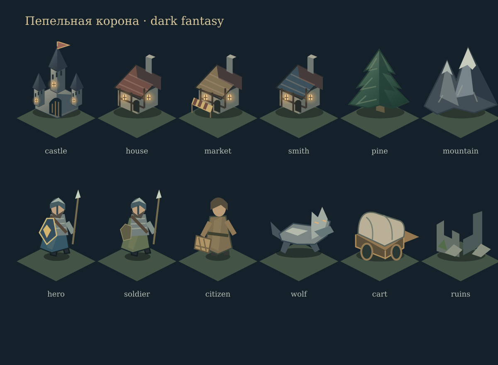

# Dark fantasy · визуальный слой

Сдержанный dark fantasy средней детализации: сланец, хвойная зелень, состаренная латунь, тёплый свет окон. Полностью 2D, без внешних ассетов и шрифтов.

- `apps/web/src/art.ts`: оригинальные SVG-рисунки деревьев, скал, домов, рынка, кузницы, крепости, руин, героя, солдат, жителей, волков, караванов, камней и костра. Phaser один раз преобразует их в текстуры; увеличение не требует загрузки новых файлов.
- `apps/web/src/game.tsx`: изометрический рельеф с фактурой, дороги, объекты с сортировкой по глубине, цветовые знаки держав, выделение героя и маршрута. Отдельные сцены поселения и боя используют тот же набор рисунков.
- `apps/web/public/ashen-landscape.svg`: ночной пейзаж для создания персонажа.
- `apps/web/src/style.css`: оформление панелей, кнопок, герба, журнала и адаптация для небольших экранов.

Управление камерой: перетаскивание, колесо мыши или кнопки +/−. Кнопка ⌖ возвращает общий вид. Координаты выбора поселения и боевых приказов учитывают положение и масштаб камеры.

Это стилизованная векторная графика, не фотореализм и не pixel art. В этой итерации нет покадровой анимации походки/атаки, погодных частиц или индивидуальной экипировки каждого NPC. Положение и здоровье бойцов по-прежнему определяет сервер.

Визуальная вариативность рассчитывается по координатам и не расходует RNG симуляции. Косметический свет не зависит от календарных шагов.

Проверки: production build, 17 существующих тестов, Prisma generate и форматирование. PostgreSQL-тест по-прежнему требует отдельного окружения. Иллюстрации проверяются отдельным SVG-рендером; интерактивная проверка локального клиента управляемым браузером недоступна из-за ограничения localhost.
